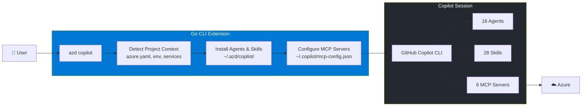
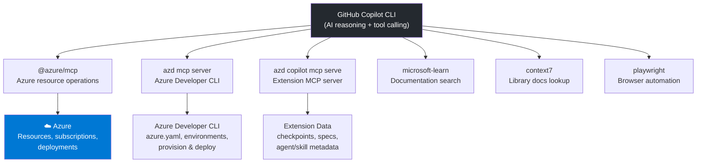
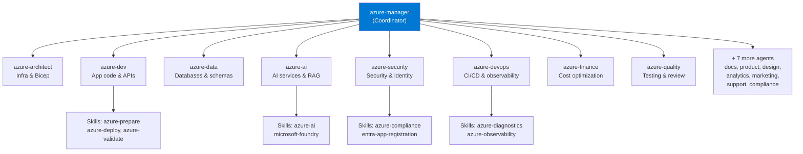
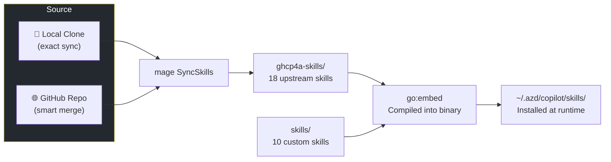

# azd copilot

**Describe what you want. Copilot builds it and deploys it to Azure.**

`azd copilot` is an [Azure Developer CLI](https://learn.microsoft.com/azure/developer/azure-developer-cli/) extension that turns GitHub Copilot CLI into a full-stack Azure development assistant — 16 specialized agents, 28 Azure skills, and 6 MCP servers working together so you can go from idea to deployed app in one command.

```
  _                        ___            _ _       _
 /_\  ___ _  _ _ _ ___    / __|___ _ __  (_) |___  | |_
/ _ \|_ / || | '_/ -_)  | (__/ _ \ '_ \ | | / _ \ |  _|
/_/ \_\/__|\_,_|_| \___|   \___\___/ .__/ |_|_\___/  \__|
                                   |_|
AI-powered Azure development assistant
Built on Copilot SDK • Azure MCP • Azure Developer CLI • Azure Agents & Skills
Version 0.1.0 • 16 agents • 28 skills
```

---

## Quick Start

### 1. Install Azure Developer CLI

- **Windows**: `winget install microsoft.azd`
- **macOS**: `brew tap azure/azd && brew install azd`
- **Linux**: `curl -fsSL https://aka.ms/install-azd.sh | bash`

### 2. Install the Extension

```bash
# Add the azd-copilot extension registry
azd extension source add -n copilot -t url -l https://raw.githubusercontent.com/jongio/azd-copilot/main/registry.json

# Install the extension
azd extension install jongio.azd.copilot
```

### 3. Run It

```bash
# Start an interactive session
azd copilot

# Or describe what you want
azd copilot -p "build me a REST API with PostgreSQL and deploy it"

# Build a complete app from a description
azd copilot build "todo app with React frontend and Azure Functions backend"
```

## What It Does

When you run `azd copilot`, the extension:

1. **Installs 16 specialized agents** to `~/.copilot/agents/` — each an expert in a domain (architecture, security, DevOps, data, AI, etc.)
2. **Installs 28 focused skills** to `~/.copilot/skills/` — step-by-step playbooks for Azure tasks (deploy, prepare, validate, cost-optimize, etc.)
3. **Configures 6 MCP servers** in `~/.copilot/mcp-config.json` — Azure, azd, Microsoft Learn, Context7, Playwright, and the extension's own MCP server
4. **Launches GitHub Copilot CLI** with all of the above pre-loaded

The result: Copilot understands Azure deeply and can build, test, deploy, diagnose, and optimize your applications.

## Commands

### Core

| Command | Description |
|---------|-------------|
| `azd copilot` | Start an interactive AI session |
| `azd copilot -p "prompt"` | Run a single prompt non-interactively |
| `azd copilot --resume` | Resume the previous session |
| `azd copilot --agent azure-security` | Use a specific agent |
| `azd copilot --yolo` | Auto-approve all tool executions |

### Build

| Command | Description |
|---------|-------------|
| `azd copilot build "description"` | Generate a complete app from a description |
| `azd copilot build --mode prototype "demo chat app"` | Quick prototype with free tiers |
| `azd copilot build --approve` | Build from an approved spec |

The build process generates a spec → waits for approval → generates code, infra, tests, docs → runs preflight → deploys.

### Quick Actions

| Command | Description |
|---------|-------------|
| `azd copilot init` | Scan a project and generate Azure config |
| `azd copilot review` | AI-powered code review |
| `azd copilot fix` | Auto-fix build errors and test failures |
| `azd copilot optimize` | Cost and performance optimization |
| `azd copilot diagnose` | Troubleshoot Azure deployment issues |

### Management

| Command | Description |
|---------|-------------|
| `azd copilot agents` | List all available agents |
| `azd copilot skills` | List all available skills |
| `azd copilot sessions` | List and manage Copilot sessions |
| `azd copilot checkpoints` | Manage build checkpoints |
| `azd copilot spec` | View or edit the project spec |
| `azd copilot context` | Show current azd project context |
| `azd copilot version` | Show version info |
| `azd copilot mcp configure` | Configure MCP servers |

## Agents

16 specialized agents, each an expert in a specific domain:

| Agent | Role |
|-------|------|
| `azure-manager` | **Coordinator** — plans work, delegates to other agents |
| `azure-architect` | Infrastructure design, Bicep, networking |
| `azure-dev` | Application code, APIs, frontend |
| `azure-data` | Database schema, queries, migrations |
| `azure-ai` | AI services, RAG, agent frameworks |
| `azure-security` | Security audits, identity, compliance |
| `azure-devops` | CI/CD, deployment, observability |
| `azure-finance` | Cost estimation, optimization, TCO analysis |
| `azure-quality` | Testing, code review, refactoring |
| `azure-docs` | README, API docs, ADRs, runbooks |
| `azure-product` | Requirements, acceptance criteria, specs |
| `azure-design` | WCAG compliance, accessibility, UI review |
| `azure-analytics` | Usage analytics, dashboards, metrics |
| `azure-marketing` | Positioning, landing pages, competitive analysis |
| `azure-support` | Troubleshooting, FAQ, error messages |
| `azure-compliance` | Framework assessment (GDPR, SOC2, HIPAA) |

## Skills

28 curated skills providing deep expertise. Skills come from two sources:

- **Upstream skills** (18) — synced from [microsoft/GitHub-Copilot-for-Azure](https://github.com/microsoft/GitHub-Copilot-for-Azure) via `mage SyncSkills`
- **Custom skills** (10) — maintained in this repo

Skills cover: preparing apps for Azure, deploying, validating, cost optimization, diagnostics, networking, observability, AI services, storage, PostgreSQL, Cosmos DB, Functions, Container Apps, security, Entra ID, and more.

Run `azd copilot skills` to see the full list.

## MCP Servers

The extension auto-configures these MCP servers for Copilot CLI:

| Server | Purpose |
|--------|---------|
| `azure` | Azure resource operations via `@azure/mcp` |
| `azd` | Azure Developer CLI operations |
| `azd-app` | This extension's own MCP server (agents, skills, checkpoints) |
| `microsoft-learn` | Microsoft Learn documentation search |
| `context7` | Library documentation lookup |
| `playwright` | Browser automation and E2E testing |

## Architecture

### How It Works

When you run `azd copilot`, the Go extension bootstraps a full AI development environment and hands off to GitHub Copilot CLI:



### GitHub Copilot CLI + MCP Servers

Copilot CLI acts as the AI brain. MCP servers give it tools to interact with Azure, your project, documentation, and the browser:



### Agents & Skills

Agents are domain experts that Copilot delegates to. Skills are step-by-step playbooks that agents follow. The **azure-manager** agent coordinates all others:



### Build Flow

The `azd copilot build` command goes from description to deployed app in two phases:

```mermaid
flowchart LR
    Desc["📝 Description"] --> Spec

    subgraph Phase1 ["Phase 1: Spec Generation"]
        Spec["Generate Spec\n(azure-manager agent)"] --> Review["👤 User Review\ndocs/spec.md"]
    end

    Review -->|"azd copilot build --approve"| Build

    subgraph Phase2 ["Phase 2: Build & Deploy"]
        Build["Design\nazure.yaml, architecture"] --> Develop["Develop\nbackend, frontend, DB"]
        Develop --> Test["Quality\ntests, lint, security"]
        Test --> Infra["Infrastructure\nBicep, CI/CD, docs"]
        Infra --> Deploy["Deploy\nazd up"]
    end

    Deploy --> Live["🚀 Live on Azure"]

    style Phase1 fill:#24292f,color:#fff
    style Phase2 fill:#0078D4,color:#fff
```



### Upstream Skill Sync

Skills from [microsoft/GitHub-Copilot-for-Azure](https://github.com/microsoft/GitHub-Copilot-for-Azure) are synced into this repo. Local source uses exact sync; remote uses smart merge to preserve local edits:



### Project Structure

```
cli/
├── src/
│   ├── cmd/copilot/           # CLI commands (cobra)
│   │   ├── main.go            # Entry point, root command, session launcher
│   │   └── commands/          # Subcommands (build, agents, skills, etc.)
│   └── internal/
│       ├── assets/            # Embedded agents & skills
│       │   ├── agents/        # 16 agent definitions (*.md)
│       │   ├── ghcp4a-skills/ # Upstream skills (synced from GitHub)
│       │   └── skills/        # Custom skills
│       ├── copilot/           # Copilot CLI launcher & MCP config
│       ├── checkpoint/        # Build checkpoint management
│       ├── spec/              # Project spec generation
│       ├── cache/             # Caching utilities
│       └── logging/           # Structured logging
├── magefile.go                # Build automation (mage)
└── extension.yaml             # azd extension manifest
```

## Development

### Prerequisites

- [Go 1.25+](https://golang.org/dl/)
- [Azure Developer CLI (azd)](https://learn.microsoft.com/azure/developer/azure-developer-cli/install-azd)
- [Mage](https://magefile.org/) (optional, for build automation)

### Build & Test

```bash
cd cli

# Build, lint, test, and install
mage           # runs All (fmt → lint → test → build → install)

# Or individually
mage build     # build + install to ~/.azd/extensions/
mage test      # run tests
mage lint      # run golangci-lint
mage fmt       # format code

# Without mage
go build ./...
go test ./...
```

### Upstream Skill Workflow

```bash
# Pull latest skills from upstream main (default)
mage SyncSkills

# Sync from a local clone of the upstream repo
mage SyncSkills C:\code\GitHub-Copilot-for-Azure

# Sync from a different repo or branch
mage SyncSkills https://github.com/user/fork.git
mage SyncSkills https://github.com/user/fork.git@my-branch

# Contribute your skill changes back upstream
mage ContributeSkills
```

The sync uses **smart merge** — your local changes are preserved, new upstream files are added, and only unmodified files are updated.

### Adding a Custom Skill

Create a directory in `cli/src/internal/assets/skills/` with a `SKILL.md`:

```
skills/my-skill/
├── SKILL.md           # Required — YAML frontmatter (name, description) + instructions
├── references/        # Optional — additional docs
└── assets/            # Optional — templates
```

Then run `mage UpdateCounts` to update agent/skill counts across the project.

## License

MIT
